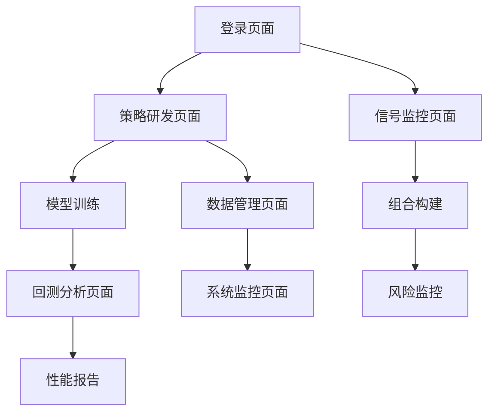

# NAXS量化投研系统与Qlib集成产品需求文档

## 1. 产品概述

NAXS量化投研系统将集成Microsoft Qlib作为核心量化引擎，构建完整的量化研究工作流程。Qlib负责数据处理、特征工程、模型训练、预测打分和回测分析等核心量化功能，NAXS负责编排、接口标准化和可视化展示。

本集成方案采用模块解耦设计，确保系统的可扩展性和生产环境的稳定性，同时满足合规要求和风险管控需求。

## 2. 核心功能

### 2.1 用户角色

| 角色    | 注册方式    | 核心权限             |
| ----- | ------- | ---------------- |
| 量化研究员 | 邮箱注册+审核 | 创建策略、训练模型、查看回测报告 |
| 投资经理  | 邀请码注册   | 查看信号、审批策略、风险监控   |
| 系统管理员 | 内部分配    | 系统配置、用户管理、数据管理   |

### 2.2 功能模块

本系统包含以下核心页面：

1. **策略研发页面**：模型配置、特征工程、训练监控
2. **回测分析页面**：历史回测、性能分析、风险指标
3. **信号监控页面**：实时信号、历史表现、组合权重
4. **数据管理页面**：数据源配置、数据质量监控、更新状态
5. **系统监控页面**：任务状态、资源使用、错误日志

### 2.3 页面详情

| 页面名称   | 模块名称  | 功能描述                 |
| ------ | ----- | -------------------- |
| 策略研发页面 | 模型配置器 | 选择算法模型、设置超参数、配置特征集   |
| 策略研发页面 | 训练监控器 | 实时显示训练进度、损失曲线、验证指标   |
| 策略研发页面 | 实验管理器 | 管理实验版本、对比实验结果、模型版本控制 |
| 回测分析页面 | 回测引擎  | 配置回测参数、执行历史回测、生成报告   |
| 回测分析页面 | 性能分析器 | 展示收益曲线、风险指标、最大回撤分析   |
| 回测分析页面 | 归因分析器 | 因子贡献分析、行业配置分析、风格暴露   |
| 信号监控页面 | 信号展示器 | 展示最新预测信号、历史信号变化趋势    |
| 信号监控页面 | 组合构建器 | 基于信号构建投资组合、权重优化      |
| 信号监控页面 | 预警系统  | 异常信号检测、风险预警、合规检查     |
| 数据管理页面 | 数据源管理 | 配置数据源、数据更新调度、质量监控    |
| 数据管理页面 | 数据预处理 | 数据清洗、缺失值处理、异常值检测     |
| 系统监控页面 | 任务调度器 | 管理定时任务、监控执行状态、错误处理   |
| 系统监控页面 | 资源监控器 | CPU/内存使用率、存储空间、网络状态  |

## 3. 核心流程

### 量化研究员工作流程

1. 登录系统 → 策略研发页面
2. 配置模型参数 → 选择特征集 → 启动训练
3. 监控训练进度 → 查看验证结果 → 保存模型版本
4. 配置回测参数 → 执行历史回测 → 分析回测报告
5. 部署生产模型 → 监控实时信号 → 性能跟踪

### 投资经理工作流程

1. 登录系统 → 信号监控页面
2. 查看最新信号 → 分析历史表现 → 风险评估
3. 审批策略部署 → 设置风险限额 → 监控组合表现

## 4. 用户界面设计

### 4.1 设计风格

* **主色调**：深蓝色(#1f2937)和科技蓝(#3b82f6)

* **辅助色**：成功绿(#10b981)、警告橙(#f59e0b)、错误红(#ef4444)

* **按钮样式**：圆角矩形，渐变背景，悬停效果

* **字体**：系统默认字体，标题16px，正文14px，说明12px

* **布局风格**：卡片式布局，左侧导航，顶部面包屑导航

* **图标风格**：线性图标，统一风格，支持深色模式

### 4.2 页面设计概览

| 页面名称   | 模块名称  | UI元素                    |
| ------ | ----- | ----------------------- |
| 策略研发页面 | 模型配置器 | 下拉选择框、滑块控件、参数输入框、配置预览卡片 |
| 策略研发页面 | 训练监控器 | 进度条、实时图表、指标卡片、日志面板      |
| 回测分析页面 | 性能分析器 | 交互式图表、指标表格、时间选择器、导出按钮   |
| 信号监控页面 | 信号展示器 | 数据表格、趋势图表、筛选器、刷新按钮      |
| 数据管理页面 | 数据源管理 | 配置表单、状态指示器、操作按钮、日志查看器   |
| 系统监控页面 | 资源监控器 | 仪表盘图表、告警面板、系统状态卡片、操     |

